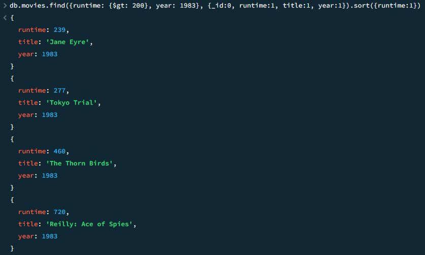
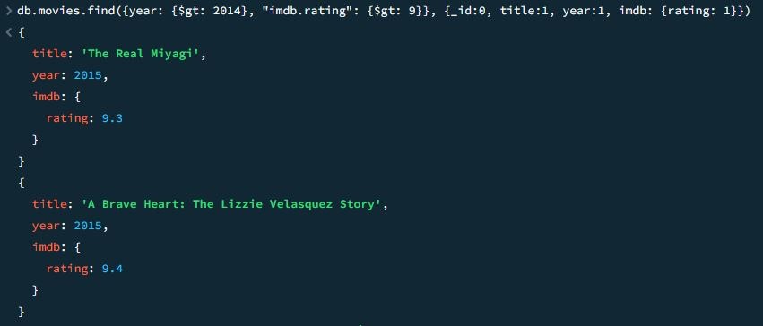

# CS3980-HW3
This is the README file for the third assignment in CS:3980 for the Spring 2024 semester.

## First Query

This query finds all movies with runtime greater than 200 minutes in year 1983. The result includes a list of objects sorted by runtime increasing, and each object only has three fields: runtime, title, year.

## Second Query

This query finds all movies after year 2014 with imdb rating greater than 9.